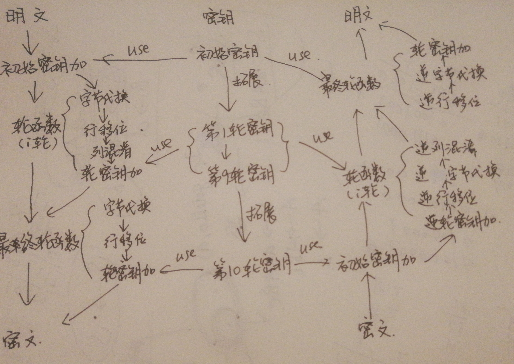

#lab2实验报告

1811464 郑佶

## AES 模块化设计

### 函数模块划分

`set_key`:设置128位密钥,以及进行密钥拓展

`key_extend`:对输入密钥进行拓展

`mycopy`:复制字符串(防止直接引用)

`hex_bin_sub`,`bin_hex_sub`:二进制字符与十六进制字符之间的转换

`hex_bin_map`,`bin_hex_map`:二进制字符与十六进制字符之间的转换映射表

`left_shift`:左移位,代替<<

`row_loop_left_shift`:针对一行(32位数据)进行循环移位

`hex_xor`,`bin_xor`:进行按位异或运算

`byte_multi`:对两个字(1个字即2个十六进制字符)进行乘法,结果也为一个字

`byte_sub`,`rev_byte_sub`:根据S盒对每个字进行字节替换(或逆替换)

`row_shift`,`rev_row_shift`:根据行移位表对密文(128位数据)进行行移位变换(逆变换)

`select_byte`:将128位密文看作4*4的字矩阵,取特定行和列的字

`select_row_key`:将128位密文看作4*4的字矩阵,取特定行的4个字

`select_roll_key`:将拓展密钥看作44*4的字矩阵,取特定轮的所需要的轮密钥(4个行,16个字,128位)

`column_mix`,`rev_column_mix`:将128位密文看作4*4的字矩阵,进行列混淆变换(逆变换)

`row_T_func`:密钥拓展需要的函数,输出和输入均是一行字(4个字,32位)的密钥

`_aes_encrypt`:完整的加密函数

`_aes_decrypt`完整的解密函数

### 顶层模块流程图

### 各代码文件功能

`aes.cpp`:主入口函数,实现加密,解密,测试雪崩效应的功能

`aes.h`:函数定义头文件,完成上述模块化设计的所有功能函数

`array.h`:存储各类复杂的数组的头文件