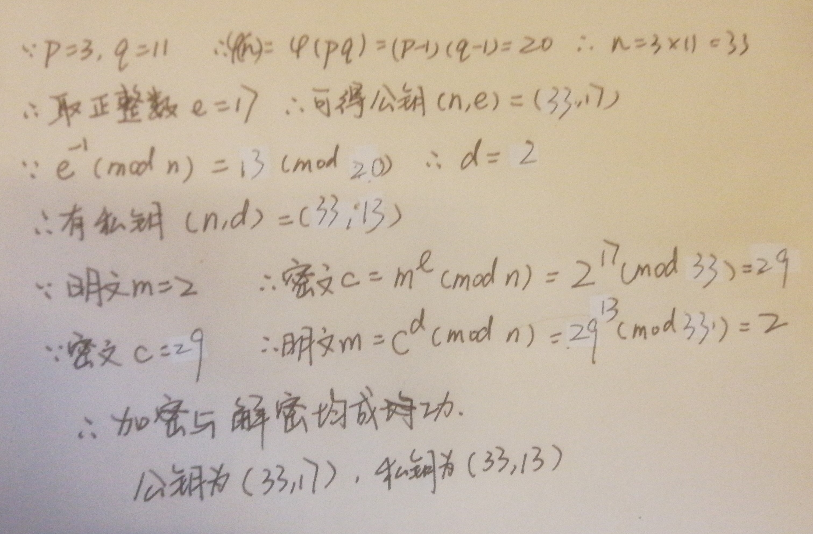
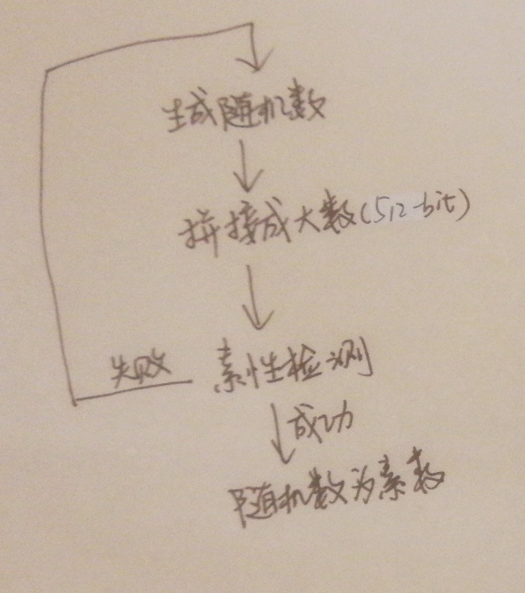
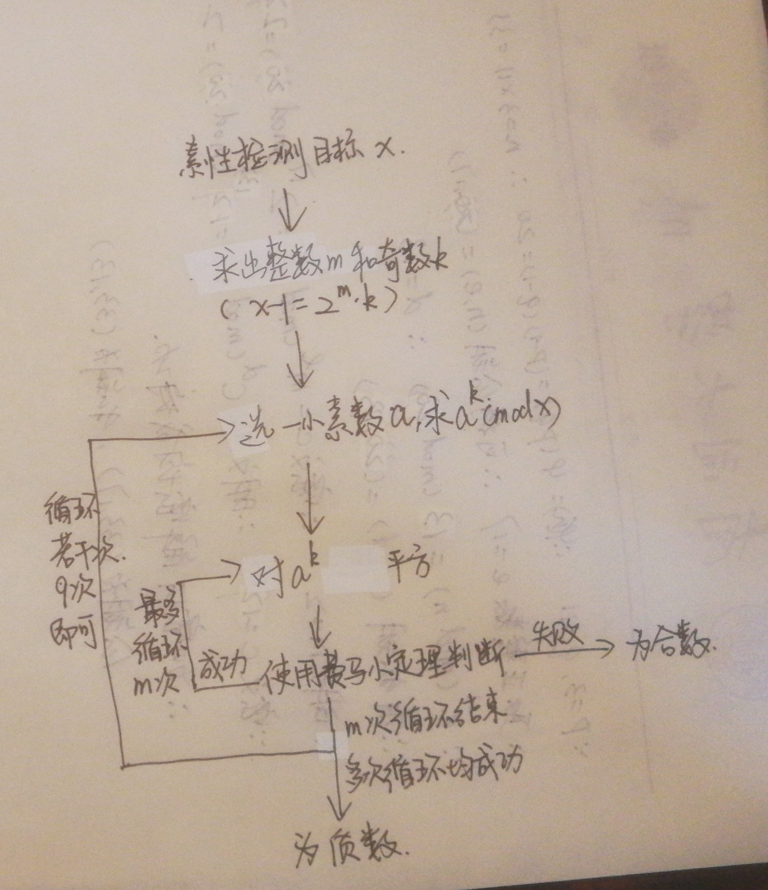
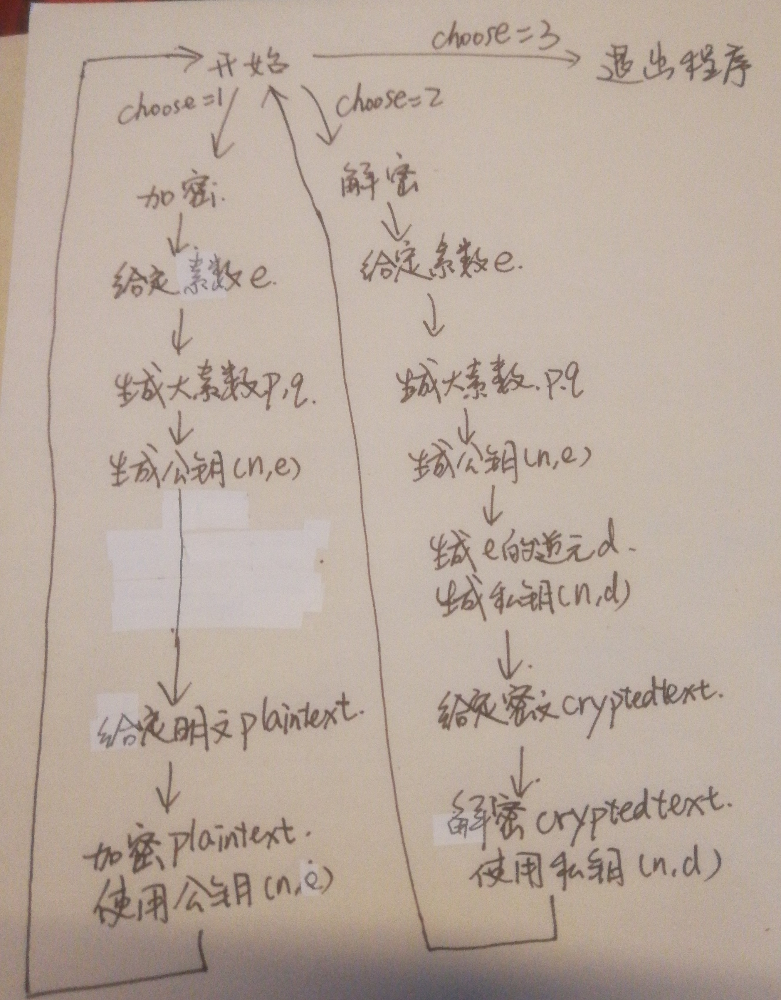
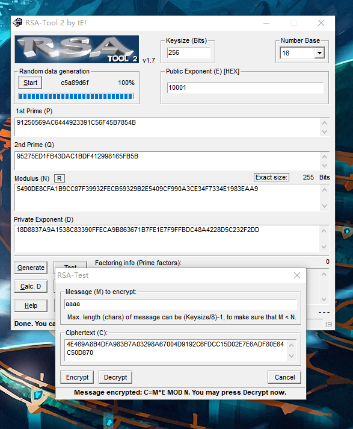

# lab4 实验报告 RSA算法设计

1811464 郑佶

## RSA算法示例解答



## 素数生成程序

此程序主要分为两个部分,分别是512-bit随机数的生成和512-bit随机数的`素性检验`

### 随机数生成

使用时间种子生成32个在0~65536之间的整型数据,将其转化为二进制数据并拼接.

```c++
big_num create_512_big_num()
    {
        big_num the_big_num;
        srand((unsigned)time(NULL));
        for(int i=0;i<32;i++)
        {
            int random_num=rand()%65536;
            the_big_num.append(random_num,i);
        }
        return the_big_num;
    }
```

### 素性检验

使用`Miller-Rabin`素性检验法.

先将目标素数`x`减一后的值`x-1`分解为`2^k*m`的形式,其中`m`为奇数.

根据费马小定理,循环使用二次探测进行素性检验.

```c++
bool is_prime(int _times=20)
    {   //use Miller-Rabin test
        //two_times :2's times,is the k of (x=2^k * m)
        //odd: the odd m of (x=2^k * m)
        //use to big prime>1000
        big_num two_times,odd,ori,temp,temp2;
        big_num one(1),two(2);
        for(int i=0;i<1024;i++)
            ori.value[i]=value[i];
        temp=ori.sub(one);
        while(1)
        {
            temp2=temp.mod(two);
            if(temp2.is_zero())
            {
                two_times=two_times.add(one);
                temp=temp.div(two);
            }
            else break;
        }
        odd.mycopy(temp);
        int times=_times;
        int i=0;
        big_num _temp;
        while(i<times)
        {
            big_num a(prime_array[i++]);
            big_num b=a.mod_power(odd,ori);
            for(big_num j(1);two_times.more(j);j=j.add(one))
            {
                _temp=b.mod_mul(b,ori);
                big_num ori_1=ori.sub(one);
                if(_temp.same(one)&&!b.same(one)&&!(b.same(ori_1)))
                    return false;
                b.mycopy(_temp);
            }
            if(!b.same(one))
                return false;
        }
        return true;
    }
```

### 生成逻辑

在RSA类中设置一个大数种子,在每生成一个大数的时候都更新种子,取新大数的时候直接取大数种子加二后的值.

每次生成大数后都进行素性检验,若失败就继续生成,否则就返回生成的大素数.

```c++
big_num create_512_prime()
    {
        big_num the_big_num;
        while(1)
        {
            if(seed_is_set=false)
            {
                the_big_num=create_512_big_num();
                seed_is_set=true;
            }
            else
            {
                big_num two(2);
                the_big_num=big_num_seed.add(two);
            }
            the_big_num.value[512]=1;
            the_big_num.value[1023]=1;
            big_num_seed.mycopy(the_big_num);
            if(!the_big_num.is_prime())continue;
            break;
        }
        return the_big_num;
    }
```

### 程序框图





## RSA算法程序

程序分为`RSA加密`,`RSA解密`,退出三个分支.

### RSA加密

加密首先需要给出与大素数`p`和`q`之积`n`的欧拉函数值互素的数`e`,这里直接取小素数,如17.

再生成两个大素数`p`和`q`,并求出`e`的逆元`d`,得到公钥与私钥

最后使用公钥加密明文得到密文.

```c++
			RSA rsa;
            RSA rsa;
            cout<<"give little prime (like 17,19,23):\n";
            int _e;
            cin>>_e;
            big_num one(1);
            big_num e(_e);
            big_num p=rsa.create_512_prime();
            big_num q=rsa.create_512_prime();
            big_num eula=(p.sub(one)).mul(q.sub(one));
            big_num n=p.mul(q);
            big_num inverse=rsa.inverse_mod(e,eula);
            cout<<"public key: (N,E)\n";
            eula.short_print("N=");
            e.short_print("E=");
            cout<<"private key: (N,D)\n";
            n.short_print("N=");
            inverse.short_print("D=");
            cout<<"give binary plaintext (like 010000100110110100101011110)\n";
            string plaintext_string;
            big_num plaintext(plaintext_string);
            big_num cryptedtext=plaintext.mod_power(e,n);
            cryptedtext.short_print("cryptedtext is:");
```

### RSA解密

再生成两个大素数`p`和`q`和数`e`、`d`的方式与`RSA`加密过程相同.

最后使用私钥解密密文得到明文.

```c++
			RSA rsa;
            cout<<"give little prime (like 17,19,23):\n";
            int _e;
            cin>>_e;
            big_num one(1);
            big_num e(_e);
            big_num p=rsa.create_512_prime();
            big_num q=rsa.create_512_prime();
            big_num eula=(p.sub(one)).mul(q.sub(one));
            big_num n=p.mul(q);
            big_num inverse=rsa.inverse_mod(e,eula);
            cout<<"public key: (N,E)\n";
            n.short_print("N=");
            e.short_print("E=");
            cout<<"private key: (N,D)\n";
            eula.short_print("N=");
            inverse.short_print("D=");
            cout<<"give binary cryptedtext (like 010000100110110100101011110)\n";
            string cryptedtext_string;
            big_num cryptedtext(cryptedtext_string);
            big_num plaintext=cryptedtext.mod_power(inverse,n);
            plaintext.short_print("plaintext is:");
```

### 程序框图



## 关于RSATool程序

使用该程序加密字符串"aaaa"结果如下



该程序通过生成随机大素数,并给出模数、公钥和私钥用于`RSA`加密和`RSA`解密,和本实验的设计的结果相似,但相对优化,程序运行更快.