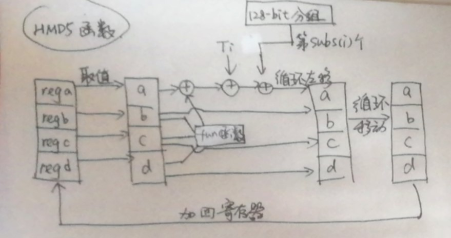
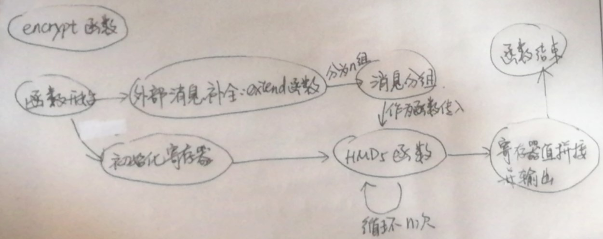
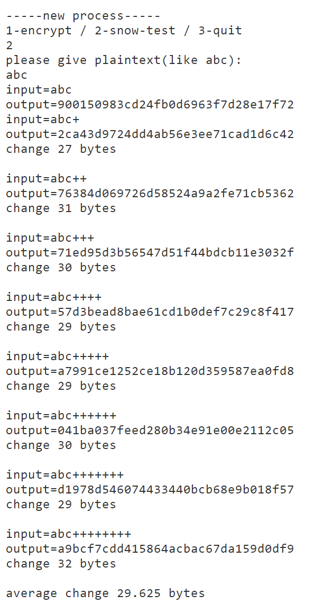

# lab5 实验报告 MD5算法设计

1811464 郑佶

## 函数基本模块

`shift`函数:用于32-bit的无符号整型的二进制形式下的循环左移

`func`函数:在`HMD5`函数中,根据最后一个参数使用F,G,H,I四个函数中的一种.由于不同的偏移量表示不同寄存器的范围,所以可以直接用偏移量除以16的商作为函数最后一个参数.

`subs`函数:在`HMD5`函数中,根据给定的参数,即取用置换表T的索引i,将其变换为值g后,用于取用整个128-bit分组的特定字符的索引.

`int_hex_sub`函数:是将存储32-bit的无符号整型的寄存器中的值取出,转换为十六进制模式的字符串,且为小端模式.

`extend`函数:将不符合512-bit倍数格式的输入加入1和若干个0和二进制长度进行补全,使用32-bit的无符号整型数组来存储.

`HMD5`函数:压缩函数的主体,将四个寄存器内的值取出存储为四个临时变量,分别进行F,G,H,I函数的处理,以及模2^32的加法和循环移位.处理完成后将临时变量值加回四个寄存器.

`encrypt`函数:完整的`MD5`哈希函数.依次进行寄存器的初始化,输入字符串拓展格式,若干轮`HMD5`函数变换,以及最后的取四个寄存器值拼接输出.

## 函数流程图

## HMD5函数

## encrypt函数

## 关于雪崩效应

在程序中测试原始字符串`abc`,并依次变换为`abc+`到`abc++++++++`,结果如下

(下图中byte指十六进制位)

如图,平均改变29.625个十六进制位,雪崩效应明显.